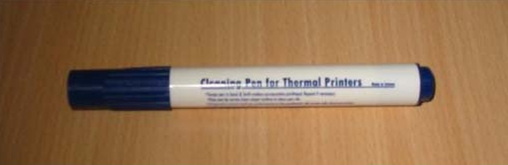
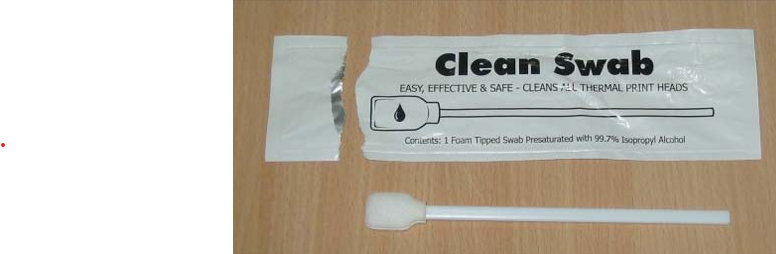
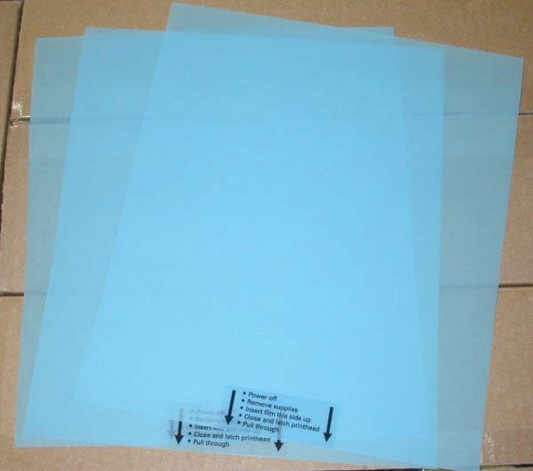

#### Zebra-Printer_Genuine Cleaning Kits
### 🧽 Zebra プリントヘッド クリーニングペン & メンテナンスキット情報シート

プリントヘッドのメンテナンスにおいて、**定期的なクリーニングは非常に重要**です。  
Zebraでは、**リボン1ロールごと**、または、**印字品質が低下したとき**にプリントヘッドの清掃を推奨しています。

---

### 🖊️ 湿式クリーニングペン

- **部品番号**：`105950-035`
- **プリントヘッドクリーニングペン** x 12本
- 軽微・局所的なクリーニングに最適です。
- モバイル・デスクトップ用

### 🏭 湿式クリーニングスワブ

- **部品番号**：`47362`
- **アルコール含浸フォームチップ綿棒** ×6本
- 汚れがひどいとき・広範囲で清掃するのに最適です。
- デスクトップ・テーブルトップ用

---

### 📄 乾式クリーニングシート

- **幅と部品番号**
    | 幅 | 部品番号 |
    |-----|-----------|
    | 8.75インチ | `22902` |
    | 6.75インチ | `38902` |
    | 5.25インチ | `48902` |
    | 4.2インチ  | `44902` |
- **クリーニングシート** ×3枚
- Silverline ZT411R 向け。
- 湿式クリーナーが利用できない現場で重宝。
※ シートは**最大10回**プリントヘッドを通して使用可能。

---

### 🛠️ 印字ヘッドの寿命を最大化させるポイント

- **印字濃度設定・圧力は最小限に**  
　→ 多くのユーザーは温度・圧力を上げて対応しがちだけど、それが逆に**焼き付き汚れの原因**になることも！
- **定期的な清掃を怠ると、印字品質が低下**  
　→ プリントヘッドの寿命を延ばすコツ！

---

### 📚 詳細情報

- Zebraの公式ガイドはこちら：  
  [Print Head Life（英語）](http://support.zebra.com/cpws/docs/general/PrintHeadLife.htm)
- 各プリンタモデルの**予防保守スケジュール**は、ユーザーガイドの「予防保守」セクションに記載されています。

